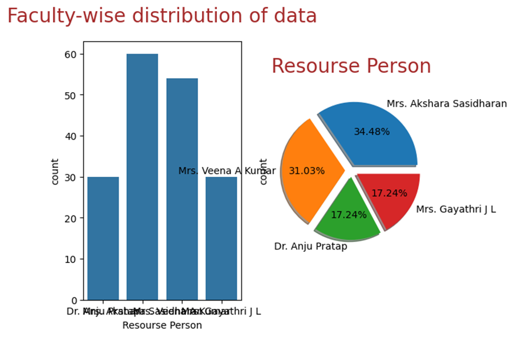
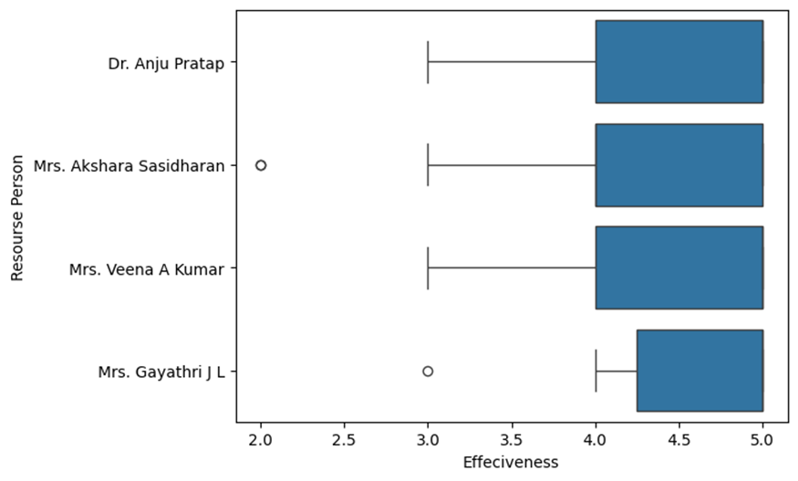
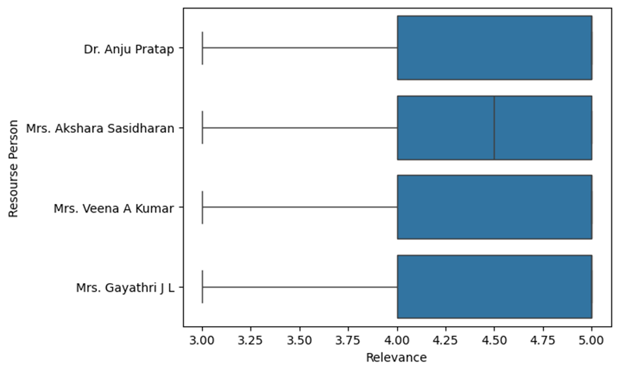
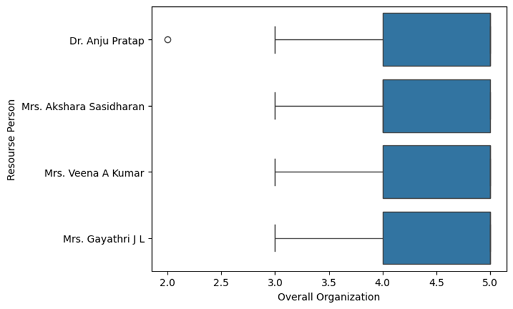
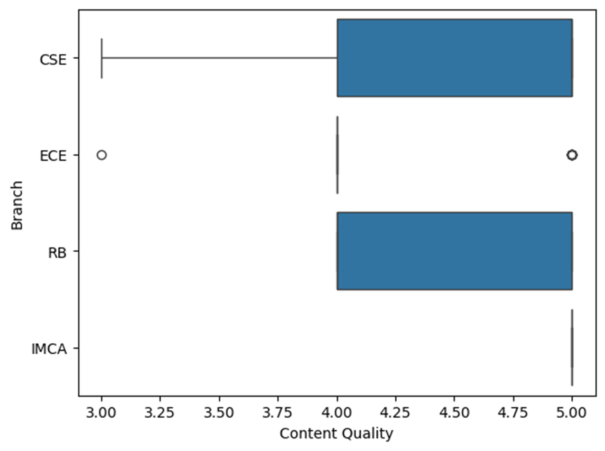
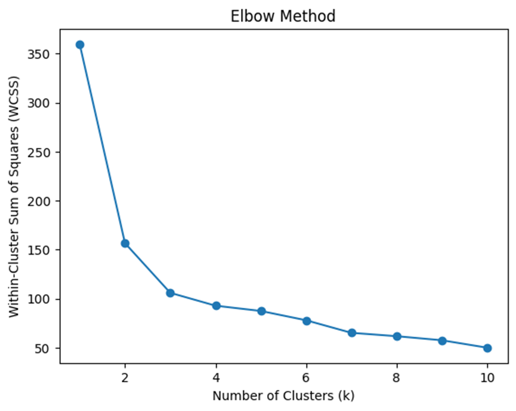
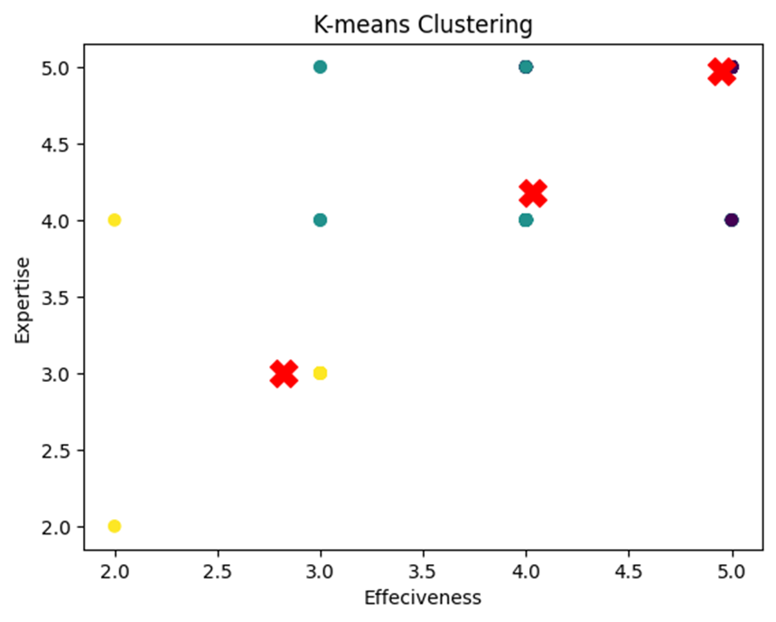

# Machine Learning Report: Feedback Data Analysis

Based on the analysis of the feedback data, the following detailed report is prepared:
  
## Faculty-Wise Distribution of Data

- The dataset consists of feedback from students across different branches and for different resource persons.
- There are 4 unique branches and 4 resource persons.
- The faculty-wise distribution of data shows varied responses for each faculty member, indicating the breadth of feedback across the sessions.

## Summary of Responses
  
# Content Quality 

- The average rating for content quality is 4.43 with a standard deviation of 0.65, indicating that most responses are positive with few variations.

# Effectiveness
  
- The average effectiveness rating is 4.46, suggesting that the teaching methods and delivery are generally effective.

# Expertise 
  
- With an average of 4.54, the resource persons are considered to have high expertise.
  
# Relevance

- The content's relevance to real-world scenarios is rated high, with an average of 4.54.

# Overall Organization
  
- The overall organization of the sessions, including time management and clarity of instructions, has an average rating of 4.48.
# Content Quality Against Branch

- The feedback data were further analyzed to understand the content quality across different branches.
- The distribution indicates that while the content quality is generally rated high, there are a few outliers suggesting room for improvement, especially in the ECE and IMCA branches.

## K-Means Clustering and Elbow Method

- The K-means clustering algorithm was used to identify segments within the student satisfaction data.

- The Elbow method was employed to determine the optimal number of clusters. The graph indicates that the sum of squares within clusters decreases significantly up to 5 clusters and then plateaus, suggesting that 5 might be the appropriate number of clusters.

## Visualizations

- Boxplots were created for each feedback metric across the resource persons and branches. These visualizations provide insights into the distribution and variance of the ratings, highlighting the strengths and potential areas for improvement.
- The clustering visualization shows how students are grouped based on their feedback on effectiveness and expertise, which can be useful for targeted improvements in course delivery and content.

## Expert Recommendations

- Focus on branches with lower median content quality scores for targeted improvements.
- Leverage the strengths of resource persons with higher median scores to train or mentor others.
- Investigate the outliers in effectiveness and expertise to understand specific concerns or issues.
- Utilize clustering information to understand the different segments of student satisfaction and tailor further improvements accordingly.

## Data Quality and Completeness

- The dataset appears to be complete with no missing values, ensuring a high level of data quality for this analysis.

Overall, the feedback data analysis using machine learning techniques provides a comprehensive understanding of student satisfaction across various metrics, offering actionable insights for continuous improvement in the educational sessions.
